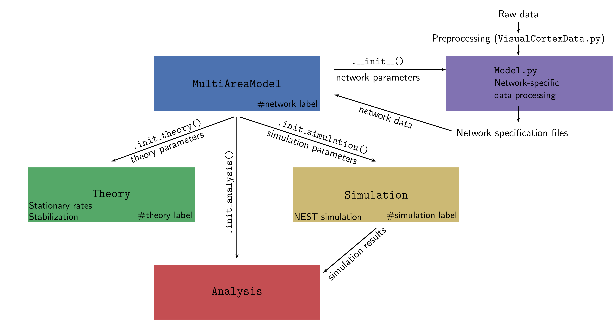

# Multi-scale spiking network model of macaque visual cortex
[](https://www.python.org) <a href="http://www.nest-simulator.org"> </a> [](https://creativecommons.org/licenses/by-nc-sa/4.0/)


This code implements the spiking network model of macaque visual cortex developed
at the Institute of Neuroscience and Medicine (INM-6), Research Center Jülich.
The model has been documented in the following publications:

1. Schmidt M, Bakker R, Hilgetag CC, Diesmann M & van Albada SJ
   Multi-scale account of the network structure of macaque visual cortex
   Brain Structure and Function (2018), 223: 1409 [https://doi.org/10.1007/s00429-017-1554-4](https://doi.org/10.1007/s00429-017-1554-4)

2. Schuecker J, Schmidt M, van Albada SJ, Diesmann M & Helias M (2017)
   Fundamental Activity Constraints Lead to Specific Interpretations of the Connectome.
   PLOS Computational Biology, 13(2): e1005179. [https://doi.org/10.1371/journal.pcbi.1005179](https://doi.org/10.1371/journal.pcbi.1005179)

3. Schmidt M, Bakker R, Shen K, Bezgin B, Diesmann M & van Albada SJ (2018)
   A multi-scale layer-resolved spiking network model of
   resting-state dynamics in macaque cortex. PLOS Computational Biology, 14(9): e1006359. [https://doi.org/10.1371/journal.pcbi.1006359](https://doi.org/10.1371/journal.pcbi.1006359)

The code in this repository is self-contained and allows one to
reproduce the results of all three papers.

A video providing a brief introduction to the model and the code in this repository can be found [here](https://www.youtube.com/watch?v=NGAqe78vmHY&t=22s).

## Try it on EBRAINS

Want to start using or simply run the model? Click the button below.<br>
**Please note**: make sure you check and follow our [User instructions](#user-instructions), especially if you plan to make and save the changes, or if you simply need step-by-step instructions.<br>
<a href="https://lab.ebrains.eu/hub/user-redirect/git-pull?repo=https%3A%2F%2Fgithub.com%2FINM-6%2Fmulti-area-model&branch=master&urlpath=lab%2Ftree%2Fmulti-area-model%2Fmulti-area-model.ipynb&branch=master"> </a>

--------------------------------------------------------------------------------

### User instructions
The Jupyter Notebook `multi-area-model.ipynb` illustrates the simulation workflow with a down-scaled version of the multi-area model. This notebook can be explored and executed online in the Jupyter Lab provided by EBRAINS without the need to install any software yourself.<br>
* Prerequisites: an [EBRAINS](https://www.ebrains.eu/) account. If you don’t have it yet, register at [register page](https://iam.ebrains.eu/auth/realms/hbp/protocol/openid-connect/registrations?response_type=code&client_id=xwiki&redirect_uri=https://wiki.ebrains.eu). Please note: registering an EBRAINS account requires an institutional email.<br>
* If you plan to only run the model, instead of making and saving changes you made, go to [Try it on EBRAINS](#try-it-on-ebrains-1); Should you want to adjust the parameters, save the changes you made, go to [Fork the repository and save your changes](#fork-the-repository-and-save-your-changes).
   
#### Try it on EBRAINS
1. Click [Try it on EBRAINS](https://lab.ebrains.eu/hub/user-redirect/git-pull?repo=https%3A%2F%2Fgithub.com%2FINM-6%2Fmulti-area-model&branch=master&urlpath=lab%2Ftree%2Fmulti-area-model%2Fmulti-area-model.ipynb&branch=master). If any error or unexpected happens during the following process, please close the browser tab and restart the [User instruction](https://lab.ebrains.eu/hub/user-redirect/git-pull?repo=https%3A%2F%2Fgithub.com%2FINM-6%2Fmulti-area-model&branch=master&urlpath=lab%2Ftree%2Fmulti-area-model%2Fmulti-area-model.ipynb&branch=master) process again.
2. On the `Lab Execution Site` page, select a computing center from the given list.
3. If you’re using EBRAINS for the first time, click `Sign in with GenericOAuth2` to sign in on EBRAINS. To do this, you need an EBRAINS account.
4. Once signed in, on the `Server Options` page, choose `Official EBRAINS Docker image 23.06 for Collaboratory.Lab (recommended)`, and click `start`.
5. Once succeeded, you’re now at a Jupyter Notebook named `multi-area-model.ipynb`. Click the field that displays `Python 3 (ipykernel)` in the upper right corner and switch the `kernel` to `EBRAINS-23.09`.
6. Congratulations! Now you can run the model. Enjoy!<br> To run the model, click the `Run` on the title bar and choose `Run All Cells`. It takes several minutes until you get all results.<br>
**Please note**: every time you click the `Try it on EBRAINS` button, the repository is loaded into your home directory on EBRAINS Lab and it overrides your old repository with the same name. Therefore, make sure you follow the [Fork the repository and save your changes](#fork-the-repository-and-save-your-changes) if you make changes and want to save them.
 
#### Fork the repository and save your changes
With limited resources, EBRAINS Lab regularly deletes and cleans data loaded on the server. This means the repository on the EBRAINS Lab will be periodically deleted. To save changes you made, make sure you fork the repository to your own GitHub, then clone it to the EBRAINS Lab, and do git commits and push changes.
1. Go to our [Multi-area model](https://github.com/INM-6/multi-area-model) under INM-6, create a fork by clicking the `Fork`. In the `Owner` field, choose your username and click `Create fork`. Copy the address of your fork by clicking on `Code`, `HTTPS`, and then the copy icon.
2. Go to [EBRAINS Lab](https://lab.de.ebrains.eu), log in, and select a computing center from the given list.
3. In the Jupyter Lab, click on the `Git` icon on the left toolbar, click `Clone a Repository` and paste the address of your fork.
4. Now your forked repository of multi-area model is loaded on the server. Enter the folder `multi-area-model` and open the notebook `multi-area-model.ipynb`.
5. Click the field that displays `Python 3 (ipykernel)` in the upper right corner and switch the `kernel` to `EBRAINS-23.09`.
6. Run the notebook! To run the model, click the `Run` on the title bar and choose `Run All Cells`. It takes several minutes until you get all results. 
7. You can modify the exposed parameters before running the model. If you want to save the changes you made, press `Control+S` on the keyboard, click the `Git` icon on the most left toolbar, do git commits and push.<br> 
To commit, on `Changed` bar, click the `+` icon, fill in a comment in the `Summary (Control+Enter to commit)` at lower left corner and click `COMMIT`.<br> 
To push, click the `Push committed changes` icon at upper left which looks like cloud, you may be asked to enter your username and password (user name is your GitHUb username, password should be [Personal access tokens](https://github.com/settings/tokens) you generated on your GitHub account, make sure you select the `repo` option when you generate the token), enter them and click `Ok`.
8. If you would like to contribute to our model or bring your ideas to us, you’re most welcome to contact us. It’s currently not possible to directly make changes to the original repository, since it is connected to our publications.

## Python framework for the multi-area model

The entire framework is summarized in the figure below:


We separate the structure of the network (defined by population sizes,
synapse numbers/indegrees etc.) from its dynamics (neuron model,
neuron parameters, strength of external input, etc.). The complete set
of default parameters for all components of the framework is defined
in `multiarea_model/default_params.py`.

A description of the requirements for the code can be found at the end of this README.

--------------------------------------------------------------------------------

### Preparations

To start using the framework, the user has to define a few environment variables
in a new file called `config.py`. The file `config_template.py` lists the required
environment variables that need to be specified by the user.

Furthermore, please add the path to the repository to your PYTHONPATH:

`export PYTHONPATH=/path/to/repository/:$PYTHONPATH`.


--------------------------------------------------------------------------------

`MultiAreaModel`

The central class that initializes the network and contains all
information about population sizes and network connectivity. This
enables reproducing all figures in [1]. Network parameters only
refer to the structure of the network and ignore any information on
its dynamical simulation or description via analytical theory.

`Simulation`

This class can be initialized by `MultiAreaModel` or as standalone and
takes simulation parameters as input. These parameters include, e.g.,
neuron and synapse parameters, the simulated biological time and also
technical parameters such as the number of parallel MPI processes and
threads. The simulation uses the network simulator NEST
(https://www.nest-simulator.org). For the simulations in [2, 3], we
used NEST version 2.8.0. The code in this repository runs with a
later release of NEST, version 2.14.0, as well as NEST 3.0.

`Theory`

This class can be initialized by `MultiAreaModel` or as standalone and
takes simulation parameters as input. It provides two main features:
- predict the stable fixed points of the system using mean-field theory and characterize them (for instance by computing the gain matrix).
- via the script `stabilize.py`, one can execute the stabilization method described in [2] on a network instance. Please see `figures/SchueckerSchmidt2017/stabilization.py` for an example of running the stabilization.

`Analysis`

This class allows the user to load simulation data and perform some
basic analysis and plotting.


## Analysis and figure scripts for [1-3]

The `figures` folder contains subfolders with all scripts necessary to produce
the figures from [1-3]. If Snakemake (Köster J & Rahmann S, Bioinformatics (2012) 28(19): 2520-2522)
is installed, the figures can be produced by executing
`snakemake` in the respective folder, e.g.:

	cd figures/Schmidt2018/
	snakemake

Note that it can sometimes be necessary to execute `snakemake --touch` to avoid unnecessary rule executions. See https://snakemake.readthedocs.io/en/stable/snakefiles/rules.html#flag-files for more details.

## Running a simulation

The files `run_example_downscaled.py` and `run_example_fullscale.py` provide examples. A simple simulation can be run in the following way:

1. Define custom parameters.
   See `multi_area_model/default_params.py` for a full list of parameters. All parameters can be customized.

2. Instantiate the model class together with a simulation class instance.

       M = MultiAreaModel(custom_params, simulation=True, sim_spec=custom_simulation_params)

3. Start the simulation.

       M.simulation.simulate()


Typically, a simulation of the model will be run in parallel on a compute cluster.
The files `start_jobs.py` and `run_simulation.py` provide the necessary framework
for doing this in an automated fashion.
The procedure is similar to a simple simulation:
1. Define custom parameters

2. Instantiate the model class together with a simulation class instance.

       M = MultiAreaModel(custom_params, simulation=True, sim_spec=custom_simulation_params)
3. Start the simulation.
   Call `start_job` to create a job file using the `jobscript_template` from the configuration file
   and submit it to the queue with the user-defined `submit_cmd`.

Be aware that, depending on the chosen parameters and initial conditions, the network can enter a high-activity state, which slows down the simulation drastically and can cost a significant amount of computing resources.

## Extracting connectivity & neuron numbers

First, the model class has to be instantiated:

1. Define custom parameters.
   See `multi_area_model/default_params.py` for a full list of parameters. All parameters can be customized.

2. Instantiate the model class.

       from multiarea_model import MultiAreaModel
       M = MultiAreaModel(custom_params)

The connectivity and neuron numbers are stored in the attributes of the model class.
Neuron numbers are stored in `M.N` as a dictionary (and in `M.N_vec` as an array),
indegrees in `M.K` as a dictionary (and in `M.K_matrix` as an array). To extract e.g.
the neuron numbers into a yaml file execute

       import yaml
       with open('neuron_numbers.yaml', 'w') as f:
           yaml.dump(M.N, f, default_flow_style=False)

Alternatively, you can have a look at the data with `print(M.N)`.

## Simulation modes

The multi-area model can be run in different modes.

1. Full model

   Simulating the entire networks with all 32 areas with default
   connectivity as defined in `default_params.py`.

2. Down-scaled model

   Since simulating the entire network with approx. 4.13 million neurons and 24.2 billion
   synapses require a large amount of resources, the user has the option to scale down
   the network in terms of neuron numbers and synaptic indegrees (number of synapses
   per receiving neuron).
   This can be achieved by setting the parameters `N_scaling` and `K_scaling` in `network_params`
   to values smaller than 1. In general, this will affect the dynamics of the network.
   To approximately preserve the population-averaged spike rates, one can specify a set of target rates
   that is used to scale synaptic weights and apply an additional external DC input.

3. Subset of the network

   You can choose to simulate a subset of the 32 areas specified by the `areas_simulated`
   parameter in the `sim_params`. If a subset of areas is simulated, one has different options for how to replace the rest of the network set by the `replace_non_simulated_areas` parameter:
   - `hom_poisson_stat`: all non-simulated areas are replaced by Poissonian spike trains with the
     same rate as the stationary background input (`rate_ext` in `input_params`).
   - `het_poisson_stat`: all non-simulated areas are replaced by Poissonian spike trains with
      population-specific stationary rate stored in an external file.
   - `current_nonstat`: all non-simulated areas are replaced by stepwise constant currents with
     population-specific, time-varying time series defined in an external file.

4. Cortico-cortical connections replaced

   In addition, it is possible to replace the cortico-cortical
   connections between simulated areas with the options
   `het_poisson_stat` or `current_nonstat`. This mode can be used with
   the full network of 32 areas or for a subset of them (therefore
   combining this mode with the previous mode 'Subset of the
   network').

5. Ground / Metastable state
   As described in Schmidt et al. (2018) (https://doi.org/10.1371/journal.pcbi.1006359),
   the model can switch between two activity regimes - the Ground state and the Metastable state.
   The switching is achieved by altering the value of the parameter ```cc_weights_factor```.

## Test suite

The `tests/` folder holds a test suite that tests different aspects of
network model initialization and mean-field calculations. It can be
conveniently run by executing `pytest` in the `tests/` folder:

	cd tests/
	pytest


## Requirements
Python 3, python\_dicthash ([https://github.com/INM-6/python-dicthash](https://github.com/INM-6/python-dicthash)),
correlation\_toolbox ([https://github.com/INM-6/correlation-toolbox](https://github.com/INM-6/correlation-toolbox)),
pandas, numpy, nested_dict, matplotlib (2.1.2), scipy, pytest, NEST 2.14.0 or NEST 3.0

Optional: seaborn, Sumatra

To install the required packages with pip, execute:

`pip install -r requirements.txt`

Note that NEST needs to be installed separately, see <http://www.nest-simulator.org/installation/>.

In addition, reproducing the figures of [1] requires networkx, python-igraph, pycairo and pyx. To install these additional packages, execute:

`pip install -r figures/Schmidt2018/additional_requirements.txt`

In addition, Figure 7 of [1] requires installing the `infomap` package to perform the map equation clustering. See <http://www.mapequation.org/code.html> for all necessary information.

Similarly, reproducing the figures of [3] requires statsmodels, networkx, pyx, python-louvain, which can be installed by executing:

`pip install -r figures/Schmidt2018_dyn/additional_requirements.txt`

The SLN fit in `multiarea_model/data_multiarea/VisualCortex_Data.py` and `figures/Schmidt2018/Fig5_cc_laminar_pattern.py` requires an installation of R and the R library `aod` (<http://cran.r-project.org/package=aod>). Without R installation, both scripts will directly use the resulting values of the fit (see Fig. 5 of [1]).

The calculation of BOLD signals from the simulated firing rates for Fig. 8 of [3] requires an installation of R and the R library `neuRosim` (<https://cran.r-project.org/web/packages/neuRosim/index.html>).

## Contributors

All authors of the publications [1-3] made contributions to the
scientific content. The code base was written by Maximilian Schmidt,
Jannis Schuecker, and Sacha van Albada with small contributions from
Moritz Helias. Testing and review was supported by Alexander van
Meegen.

## Citation

If you use this code, we ask you to cite the appropriate papers in your publication. For the multi-area model itself, please cite [1] and [3]. If you use the mean-field theory or the stabilization method, please cite [2] in addition. We provide bibtex entries in the file called `CITATION`.

If you have questions regarding the code or scientific content, please create an issue on github.

&nbsp; &nbsp; &nbsp; &nbsp; &nbsp; &nbsp; &nbsp; &nbsp; 

## Acknowledgements

We thank Sarah Beul for discussions on cortical architecture; Kenneth Knoblauch for sharing his R code
for the SLN fit (`multiarea_model/data_multiarea/bbalt.R`); and Susanne Kunkel for help with creating Fig. 3a of [1] (`figures/Schmidt2018/Fig3_syntypes.eps`).

This work was supported by the Helmholtz Portfolio Supercomputing and
Modeling for the Human Brain (SMHB), the European Union 7th Framework
Program (Grant 269921, BrainScaleS and 604102, Human Brain Project,
Ramp up phase) and European Unions Horizon 2020 research and
innovation program (Grants 720270 and 737691, Human Brain Project, SGA1 and SGA2), the
Jülich Aachen Research Alliance (JARA), the Helmholtz young
investigator group VH-NG-1028,and the German Research Council (DFG
Grants SFB936/A1,Z1 and TRR169/A2) and computing time granted by the
JARA-HPC Ver- gabegremium and provided on the JARA-HPC Partition part
of the supercomputer JUQUEEN (Jülich Supercomputing Centre 2015) at
Forschungszentrum Jülich (VSR Computation Time Grant JINB33), and Priority
Program 2041 (SPP 2041) "Computational Connectomics" of the German Research
Foundation (DFG).
