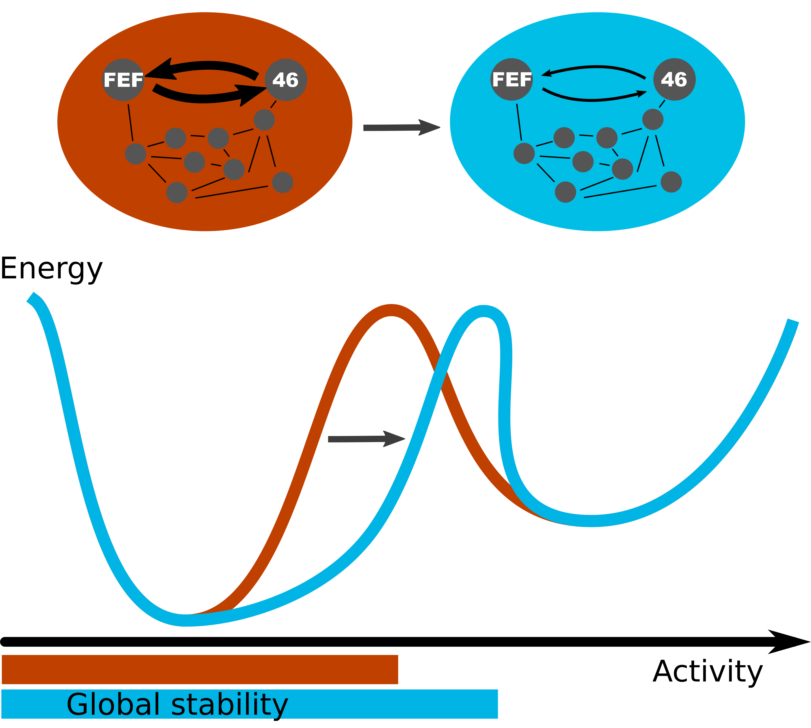

## Figures of Schuecker J, Schmidt M, van Albada SJ, Diesmann M & Helias M (2017) Fundamental Activity Constraints Lead to Specific Interpretations of the Connectome.

This folder contains the scripts to reproduce all figures of Schuecker J, Schmidt M, van Albada SJ, Diesmann M & Helias M (2017) Fundamental Activity Constraints Lead to Specific Interpretations of the Connectome. PLOS Computational Biology, 13(2). [https://doi.org/10.1371/journal.pcbi.1005179](https://doi.org/10.1371/journal.pcbi.1005179)

The figure scripts are named according to their ordering in the paper. To execute them, the stabilization procedure has to be executed first, by running the `stabilization.py` script.

Please note: The stabilization procedure is based on computing the fixed points of the multi-area network with mean-field theory, i.e. solving Eq. (3) in Schuecker, Schmidt et al. In the paper, this equation was solved using the fourth-order Runge-Kutta method (RK4) implemented in Python (see Methods of Schuecker, Schmidt et al.). 

In this code, the equation is solved using the NEST simulator, which uses the exponential Euler algorithm. We make this switch because it significantly reduces computation time. At the time of producing the data for the paper, this NEST code had not been available yet.

This leads to qualitatively very similar results in the figures and the resulting connectivity matrix. To reproduce the figures of Schuecker, Schmidt et al. (2017) one-to-one, we refer the user to the Dryad Digital Repository database ([DOI: 10.5061/dryad.vn342](https://datadryad.org/resource/doi:10.5061/dryad.vn342)).

Specifically, the following deviations can be observed:
- Generally, we find that the algorithm visits the unstable fixed points in a different order. While the first unstable fixed points (iteration 1) is the same in both cases, the second unstable fixed point differs. This can be seen in Figure 6, but also in Fig. 5D.
- Figure 4: The minima of the trajectories are sharper and deeper compared to the published Figures in the paper (cf. panel C). This is likely due to the use of a different numerical method and allows better determination of the unstable fixed points.
- Figure 5: Since the determination of the unstable fixed points is an approximate procedure, its properties are subject to small deviations. This can be seen in the eigenspace (panel A) and the resulting changes (panel B).
- Figure 7: Panel A shows transitions to the high-activity points at different values of the parameters. The reason for this is that we use a pseudo-time evolution to solve Eq. 1 of Schuecker, Schmidt et al. that follows different trajectories depending on the numerical method and the initial condition.

Overall, these differences are not significant and the resulting connectivity matrix exhibits very similar properties to the published results, cf. Fig. 8.

If snakemake is installed, the figures can be produced by executing

`snakemake`

 
